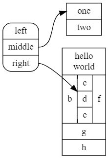

DOT语言使用概要
==============

布局
----

+ 方向，默认从上到下，即 __rankdir=TB__ ，改成 __rankdir=LR__ 则从左到右，可选TB/BT/LR/RL  
+ 引擎，默认dot，即树状，另一常用引擎circo，环状  

节点
----

+ 节点定义：  
    __node [shape=circle, fixedsize=true, width=0.9, style=filled, color=white];__
    或 __node [ ... ]: v1; v2;__
+ 节点形状：
    __node [shape=ellipse|oval|circle|box|point|triangle |plaintext|plain|diamond|star|parallelogram];__  
+ 节点风格：__nodeId [style=solid|bold|filled| rounded|dashed|dotted|]__

边
--

+ 边的风格： __1 -> 2 [style=solid|bold| dashed|dotted]__
+ 边的权重： __a -- b [weight="20" ]__ 值越大边越短直
+ 箭头形状： __1 -> 2 [dir=forward|back|both|none arrowhead=normal|vee|none|diamond|crow |box|dot|inv arrowsize=1.0]__

子图
---- 

+ 同秩子图， __subgraph { rank=same; A; B; C; }__
+ 子图风格， __subgraph { style=solid|rounded|dashed|dotted|bold|filled |striped }__

> 使用技巧： dot引擎总是从秩低到秩高画，可以合理利用箭头反向（ __dir=back__ ）和控制同秩实现绘制
					
一些实例
=======

矩阵式图形
---------

graph grid  
{  
	layout=dot  
	label="grid"  
	labelloc = "t"  
	node [shape=plaintext]  
	// arbitrary path on rigid grid  
	A0 -- B1 -- C2 -- D3 -- E4 -- F5 -- G6 -- H7  
	H0 -- G1 -- F2 -- E3 -- D4 -- C5 -- B6 -- A7  

	edge [weight=1000 style=dashed color=dimgrey]  

	// uncomment to hide the grid  
	//edge [style=invis]  

	A0 -- A1 -- A2 -- A3 -- A4 -- A5 -- A6 -- A7  
	B0 -- B1 -- B2 -- B3 -- B4 -- B5 -- B6 -- B7  
	C0 -- C1 -- C2 -- C3 -- C4 -- C5 -- C6 -- C7  
	D0 -- D1 -- D2 -- D3 -- D4 -- D5 -- D6 -- D7  
	E0 -- E1 -- E2 -- E3 -- E4 -- E5 -- E6 -- E7  
	F0 -- F1 -- F2 -- F3 -- F4 -- F5 -- F6 -- F7  
	G0 -- G1 -- G2 -- G3 -- G4 -- G5 -- G6 -- G7  
	H0 -- H1 -- H2 -- H3 -- H4 -- H5 -- H6 -- H7  

	rank=same {A0 -- B0 -- C0 -- D0 -- E0 -- F0 -- G0 -- H0}  
	rank=same {A1 -- B1 -- C1 -- D1 -- E1 -- F1 -- G1 -- H1}  
	rank=same {A2 -- B2 -- C2 -- D2 -- E2 -- F2 -- G2 -- H2}  
	rank=same {A3 -- B3 -- C3 -- D3 -- E3 -- F3 -- G3 -- H3}  
	rank=same {A4 -- B4 -- C4 -- D4 -- E4 -- F4 -- G4 -- H4}  
	rank=same {A5 -- B5 -- C5 -- D5 -- E5 -- F5 -- G5 -- H5}  
	rank=same {A6 -- B6 -- C6 -- D6 -- E6 -- F6 -- G6 -- H6}  
	rank=same {A7 -- B7 -- C7 -- D7 -- E7 -- F7 -- G7 -- H7}  
}

子图例子
--------

graph G {  
	1;  
	subgraph cluster_1 {  
		style = filled;  
		color = green;  
		rank = same;  
		1;  
		3 [shape=box width=0.3];  
		5 [style=filled fillcolor=yellow];  
	}
	0 -- 3;  
	2 -- 4;  
	4 -- 2 [color=red,weight="50"];  
	4 -- {5 8} [style=dashed];  
	5 -- {7 8};  
	7 -- {6 [label="节点1" fontsize="10" fontcolor="orange" color="blue"] 8};  
	8 -- 8 [label="自环" fontsize="8" fontcolor="brown" color="purple"];  
}	

多字段节点
----------

digraph DG {  
	rankdir=BT  
	node [style=rounded]  
	node1 [shape=box]  
	node2 [fillcolor=yellow, style="rounded,filled", shape=diamond]  
	node3 [shape=record, label="{ a | b | c }"]  

	node1 -> node2 -> node3 [penwidth="3"]  
	node3 -> node1 [arrowhead=vee]  
	4 -> 5 -> 6 [dir=back]  
	7 -> 8 -> 9 [dir=both]  
}

结构体节点
---------

digraph structs {  
	rankdir=LR;  
    node [shape=record];  
    struct1 [label="<f0> left|<f1> mid&#92;dle|<f2> right" shape=Mrecord];  
    struct2 [label="<f0> one|<f1> two"];  
    struct3 [label="hello&#92;nworld |{ b |{c|<here> d|e}| f}| g | h"];  
    struct1:f1 -> struct2:f0;  
    struct1:f2 -> struct3:here;  
}  

表格式Label（利用Html标签）
------------------------

graph G {  
    t1 [shape=none, label=<  
<table border="0" cellspacing="0">  
<tr><td width="20"></td><td width="20">0</td><td width="20">1</td></tr>  
<tr><td>0</td><td border="1">A</td><td border="1">B</td></tr>  
<tr><td>1</td><td border="1">C</td><td border="1">D</td></tr>  
</table>  
>];  
      t2 [shape=ellipse, label=<  
<table border="0" cellspacing="0">  
<tr><td width="20"></td><td width="20">0</td><td width="20">1</td></tr>  
<tr><td>0</td><td>A</td><td><i>B</i></td></tr>  
<tr><td>1</td><td bgcolor="#cc0033">C</td><td>D</td></tr>  
</table>  
>];  
}  

